# 
# 📘 EININIDII - Instalação/Configuração CODESYS V3.5 SP21 para comunicar com a ESP32 em Modbus.
> **Professor**: Josué Morais  
> **Disciplina**: Instrumentação Industrial II  
> **Curso**: Engenharia de Controle e Automação  
> **Instituição**: Universidade Federal de Uberlândia — FEELT  

  
<strong>📑 Índice </strong>

- [🎯 Objetivo](#objetivo)
- [🧰 Pré-requisitos](#pré-requisitos)
  - [Software](#software)
  - [Hardware](#hardware)

[🧭 Instalando o Codesys](#instalando-o-codesys)
  - [Passo 1 – Acessar o instalador do CODESYS](#instalacao-passo-1)
  - [Passo 2 – Iniciar o instalador](#instalacao-passo-2)
  - [Passo 3 – Tela de boas-vindas do assistente](#instalacao-passo-3)
  - [Passo 4 – Aceitar o contrato de licença](#instalacao-passo-4)
  - [Passo 5 – Informações de versão](#instalacao-passo-5)
  - [Passo 6 – Definir pasta de instalação](#instalacao-passo-6)
  - [Passo 7 – Selecionar o tipo de instalação](#instalacao-passo-7)
  - [Passo 8 – Confirmar início da instalação](#instalacao-passo-8)
  - [Passo 9 – Aguardar a instalação dos componentes](#instalacao-passo-9)
  - [Passo 10 – Concluir a instalação](#instalacao-passo-10)

- [⚙️ Configurando o Codesys](#configurando-o-codesys)
  - [Passo 1 – Criar um novo projeto no CODESYS](#passo-1--criar-um-novo-projeto-no-codesys)
  - [Passo 2 – Selecionando o dispositivo PLC](#passo-2--selecionando-o-dispositivo-plc)
  - [Passo 3 – Escolhendo o PLC utilizado](#passo-3--escolhendo-o-plc-utilizado)
  - [Passo 4 – Inserir as configurações de Tarefas](#passo-4--inserir-as-configurações-de-tarefas)
  - [Passo 5 – Criar uma tarefa](#passo-5--criar-uma-tarefa)
  - [Passo 6 – Iniciar a adição da tarefa](#passo-6--iniciar-a-adição-da-tarefa)
  - [Passo 7 – Adicionar tarefa principal para o Loop](#passo-7--adicionar-tarefa-principal-para-o-loop)
  - [Passo 8 – Atualizar o dispositivo do PLC](#passo-8--atualizar-o-dispositivo-do-plc)
  - [Passo 9 – Adicionar o adaptador Ethernet](#passo-9--adicionar-o-adaptador-ethernet)
  - [Passo 10 – Inserir dispositivo no Ethernet](#passo-10--inserir-dispositivo-no-ethernet)
  - [Passo 11 – Adicionar Modbus TCP Client](#passo-11--adicionar-modbus-tcp-client)
  - [Passo 12 – Adicionar dispositivo no Modbus TCP Client](#passo-12--adicionar-dispositivo-no-modbus-tcp-client)
  - [Passo 13 – Adicionar Modbus TCP Server](#passo-13--adicionar-modbus-tcp-server)
  - [Passo 14 – Abrir os ícones ocultos do Windows](#passo-14--abrir-os-ícones-ocultos-do-windows)
  - [Passo 15 – Iniciar o CODESYS Control Win](#passo-15--iniciar-o-codesys-control-win)
  - [Passo 16 – Selecionar o controlador no projeto](#passo-16--selecionar-o-controlador-no-projeto)
  - [Passo 17 – Procurar o dispositivo na rede](#passo-17--procurar-o-dispositivo-na-rede)
  - [Passo 18 – Selecionar o dispositivo encontrado](#passo-18--selecionar-o-dispositivo-encontrado)
  - [Passo 19 – Selecionar a interface de rede](#passo-19--selecionar-a-interface-de-rede)
  - [Passo 20 – Habilitar reconexão automática](#passo-20--habilitar-reconexão-automática)
  - [Passo 21 – Criar canais no Modbus TCP Server](#passo-21--criar-canais-no-modbus-tcp-server)
  - [Passo 22 – Configurar o Channel 0](#passo-22--configurar-o-channel-0-coils)
  - [Passo 23 – Configurar o Channel 1](#passo-23--adicionar-channel-1-discrete-inputs)
  - [Passo 24 – Configurar o Channel 2](#passo-24--adicionar-channel-2-holding-registers)
  - [Passo 25 – Configurar o Channel 3](#passo-25--adicionar-channel-3-input-registers)
  - [Passo 26 – Conferir os canais criados](#passo-26--conferir-os-canais-criados)
  - [Passo 27 – Ajustar o Unit-ID](#passo-27--ajustar-o-unit-id-do-modbus-tcp-server)
  - [Passo 28 – Mapear variáveis do PLC](#passo-28--mapear-variáveis-do-plc)
  - [Passo 29 – Login e execução do PLC](#passo-29--login-e-execução-do-plc)
  - [Passo 30 – Inserir uma bobina no Ladder](#passo-30--inserir-uma-bobina-no-ladder)
  - [Passo 31 – Selecionar a variável da bobina](#passo-31--selecionar-a-variável-da-bobina)
  - [Passo 32 – Resultado final no Ladder](#passo-32--resultado-final-no-ladder)

- [📡 Preparando a ESP32 (ESP_Remote_IO)](#preparando-esp32)
  - [Passo 1 – Criar um fork do repositório no GitHub](#passo-1--criar-um-fork-do-repositório-no-github)
  - [Passo 2 – Confirmar a criação do fork](#passo-2--confirmar-a-criação-do-fork)
  - [Passo 3 – Abrir o Visual Studio Code](#passo-3--abrir-o-visual-studio-code)
  - [Passo 4 – Abrir a tela inicial do VS Code](#passo-4--abrir-a-tela-inicial-do-vs-code)
  - [Passo 5 – Selecionar clonagem via GitHub](#passo-5--selecionar-clonagem-via-github)
  - [Passo 6 – Escolher o repositório ESP_Remote_IO](#passo-6--escolher-o-repositório-esp_remote_io)
  - [Passo 7 – Abrir o projeto clonado](#passo-7--abrir-o-projeto-clonado)
  - [Passo 8 – Verificar a estrutura do projeto](#passo-8--verificar-a-estrutura-do-projeto)
  - [Passo 9 – Iniciar o upload para a ESP32](#passo-9--iniciar-o-upload-para-a-esp32)
  - [Passo 10 – Compilação e gravação concluídas](#passo-10--compilação-e-gravação-concluídas)

- [📡 Vinculando a ESP32 ao Codesys](#vinculando-esp32)

- [✅ Resultado esperado](#resultado-esperado)
- [⚠️ Observações importantes](#observações-importantes)
- [📚 Referências](#referências)

---

  
 <strong> 🎯 Objetivo </strong>

Este tutorial tem como objetivo orientar, de forma **didática e passo a passo**, a criação de um **projeto Modbus no CODESYS V3.5 SP21**, utilizando a ferramenta **ESP_Remote_IO**, de modo que uma **ESP32 funcione como uma Remota Modbus**, permitindo comunicação completa com o sistema de controle.

Ao final deste procedimento, o sistema estará:
- ✅ Configurado no CODESYS
- ✅ Comunicando via Modbus
- ✅ Reconhecendo a ESP32 como uma remota de I/O

---

  
<strong> 🧰 Pré-requisitos </strong>

### Software
- ✅ Windows 11
- ✅ CODESYS V3.5 SP21
- ✅ Git instalado
- ✅ ESP_Remote_IO (GitHub):
  https://github.com/ININDII-UFU/EININDII08_EspRemoteIO

### Hardware
- ✅ ESP32 configurada conforme o repositório
- ⚠️ Rede configurada corretamente (IP, firewall, cabo)

---

  
<strong> 🧭 Instalando o Codesys  </strong>

### 🔹 Passo 1 – Acessar o instalador do CODESYS

1. Acesse a pasta onde estão os arquivos de instalação
2. Localize o arquivo **CODESYS 64 3.5.21.0.exe**
3. **Clique duas vezes** sobre o instalador para iniciar

💡 *Certifique-se de utilizar a versão correta (64 bits) compatível com seu sistema.*

---

### 🔹 Passo 2 – Iniciar o instalador

1. Aguarde o carregamento do **InstallShield Wizard**
2. Clique em **Install** para prosseguir com a instalação

---

### 🔹 Passo 3 – Tela de boas-vindas do assistente

1. Na tela **Welcome to the InstallShield Wizard**
2. Clique em **Next >** para continuar

---

### 🔹 Passo 4 – Aceitar o contrato de licença

1. Leia o **License Agreement**
2. Selecione a opção **I accept the terms in the license agreement**
3. Clique em **Next >**

⚠️ *Sem aceitar os termos a instalação não prossegue.*

---

### 🔹 Passo 5 – Informações de versão (Release Information)

1. Opcionalmente, marque **I have read the information**
2. Clique em **Next >**

💡 *Esta tela apresenta informações sobre mudanças e correções da versão.*

---

### 🔹 Passo 6 – Definir pasta de instalação

1. Verifique o diretório de instalação padrão  
   (ex.: `C:\Program Files\CODESYS 3.5.21.0`)
2. Caso deseje, clique em **Change** para alterar
3. Clique em **Next >** para continuar

---

### 🔹 Passo 7 – Selecionar o tipo de instalação

1. Selecione **Complete** para instalar todos os recursos
2. Clique em **Next >**

💡 *A instalação completa é recomendada para desenvolvimento PLC.*

---

### 🔹 Passo 8 – Confirmar início da instalação

1. Revise as configurações selecionadas
2. Clique em **Install** para iniciar a instalação

---

### 🔹 Passo 9 – Aguardar a instalação dos componentes

1. Aguarde enquanto o assistente instala os componentes do CODESYS
2. Não feche esta janela durante o processo

⏳ *O tempo pode variar conforme o computador.*

---

### 🔹 Passo 10 – Concluir a instalação

1. Verifique a mensagem **InstallShield Wizard Completed**
2. Opcionalmente, marque **Show the Windows Installer**
3. Clique em **Finish** para encerrar

✅ *O CODESYS foi instalado com sucesso no sistema.*

---

  
<strong> ⚙️ Configurando o Codesys </strong>

### 🔹 Passo 1 – Criar um novo projeto no CODESYS
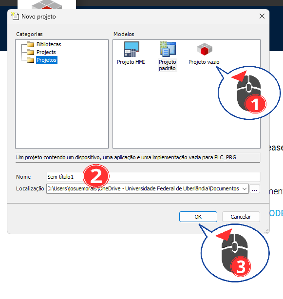

1. Abrir o CODESYS
2. Selecionar **File → New Project**
3. Escolher **Projeto vazio**
4. Dar um nome para o projeto
5. Confirmar

💡 *Este passo cria a base do projeto PLC.*

---

### 🔹 Passo 2 – Selecionando o dispositivo PLC
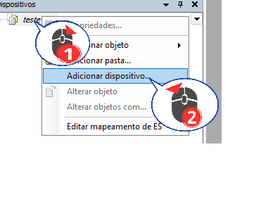

1. Na arvore de dispositivos **Clicar com o mouse direito** no nome do projeto 
2. Na opçoes que irão aparecer escolher **Adicionar dispositivos**

---

### 🔹 Passo 3 – Escolhendo o PLC utilizado 
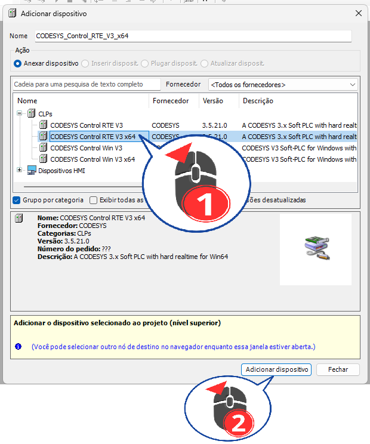

1. Na janela **Adicionar dispositivos** escolhar o PLC **CODESYS CONTROL Win V3 x64**
2. Na sequencia click no botão Adicionar dispositivo

⚠️ *Verifique se sua vertão é x64 ou x86*

---

### 🔹 Passo 4 – Inserir as configurações de Tarefas

1. Clique com botão direito em **Application**
2. Na sequencia clique em **Adicionar Objeto**
3. Por último selecione **Configuração de Tarefas**

⚠️ *A configuração de Tarefas é o responsavel por todas as rotinas ciclicas.*
---

### 🔹 Passo 5 – Criar uma tarefa

1. Clique com botão direito em **Application**
2. Na sequencia clique em **Adicionar Objeto**
3. Por último selecione **DOU**

⚠️ *Nesta etapa vc cria uma tarefa nova.*

---

### 🔹 Passo 6 – Iniciar a adição da tarefa

1. De um nome para sua tarefa tipo **PLC_PRG**
2. Clicar com o botão esquerdo sobre **Programa**
3. Selecionar **Gráfico de Linguagem Ladder (LD)**

💡 *Você pode escolher um outro tipo de linguagem para sua tarefa.*

---

### 🔹 Passo 7 – Adicionar tarefa principal para o Loop
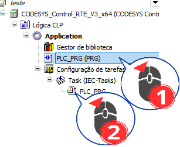

1. Clique com o mouse direito sobre o **PLC_PRG** 
2. Sem soltar o mouse arraste o mesmo para dentro de **Task (IEC_Tasks)**.

⚠️ *No loop deve ter pelo menos uma tarefa, mas pode ter mais à seu critério.*

---

### 🔹 Passo 8 – Atualizar o dispositivo do PLC
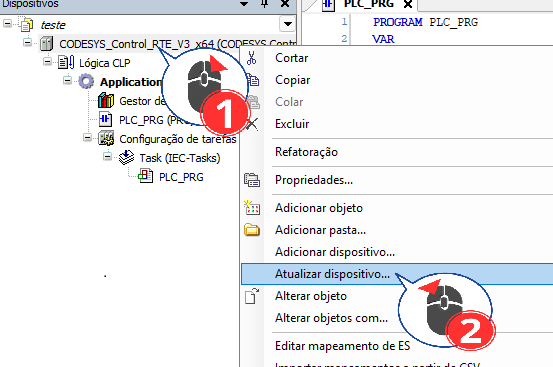

1. Na árvore de dispositivos, **clique com o botão direito** no **PLC (CODESYS Control Win V3...)**
2. Selecione **Atualizar dispositivo...**

💡 *Isso ajuda o CODESYS a recarregar as opções e dispositivos disponíveis.*

---

### 🔹 Passo 9 – Adicionar o adaptador Ethernet
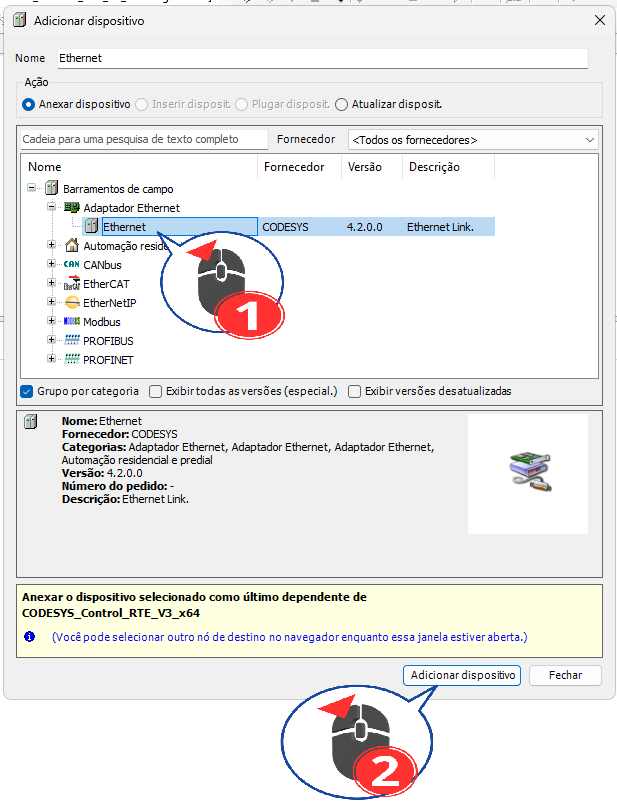

1. Na janela **Adicionar dispositivo**, selecione **Ethernet**
2. Clique em **Adicionar dispositivo**

---

### 🔹 Passo 10 – Inserir dispositivo no Ethernet
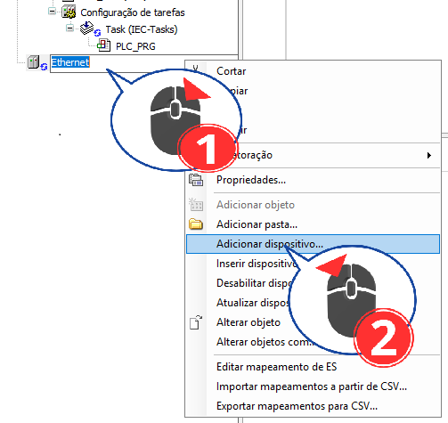

1. Clique com o botão direito em **Ethernet (Ethernet)**
2. Selecione **Adicionar dispositivo...**

---

### 🔹 Passo 11 – Adicionar Modbus TCP Client
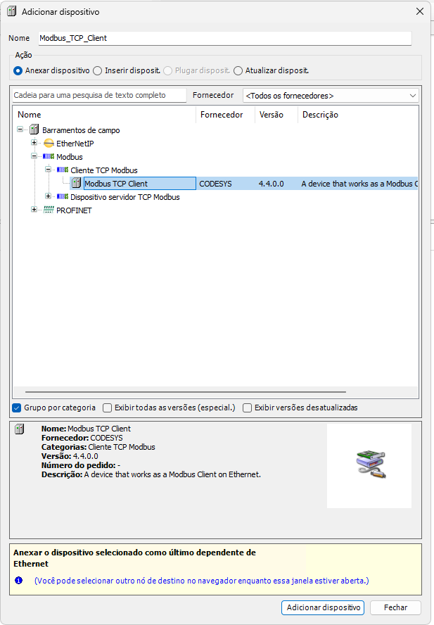

1. Selecione **Modbus TCP Client**
2. Clique em **Adicionar dispositivo**

---

### 🔹 Passo 12 – Adicionar dispositivo no Modbus TCP Client
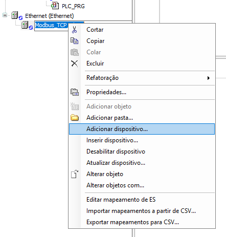

1. Clique com o botão direito em **Modbus_TCP_Client**
2. Selecione **Adicionar dispositivo...**

---

### 🔹 Passo 13 – Adicionar Modbus TCP Server
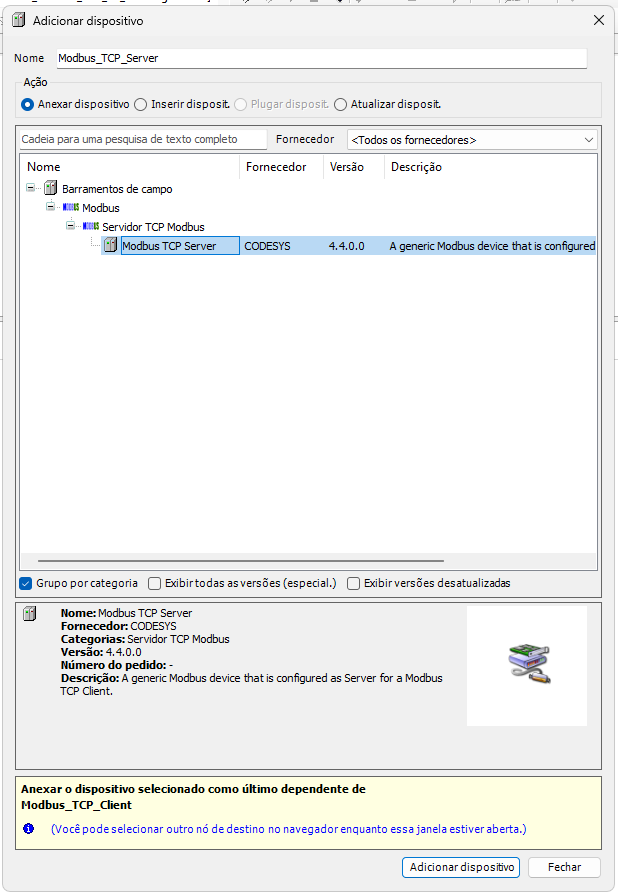

1. Selecione **Modbus TCP Server**
2. Clique em **Adicionar dispositivo**

---

### 🔹 Passo 14 – Abrir os ícones ocultos do Windows

1. Na barra do Windows, clique na seta **^** (ícones ocultos)

💡 *O CODESYS Control Win fica ativo nessa área.*

---

### 🔹 Passo 15 – Iniciar o CODESYS Control Win
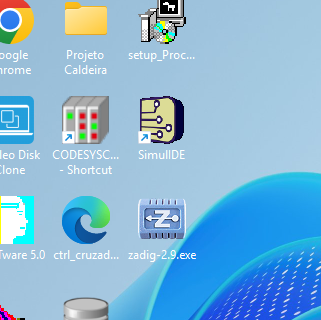

1. **Clique duas vezes** no ícone **CODESYS Control Win**

---

### 🔹 Passo 16 – Selecionar o controlador no projeto

1. Selecione **CODESYS Control WIN...** na árvore de dispositivos

---

### 🔹 Passo 17 – Procurar o dispositivo na rede

1. Em **Communication Settings**, clique em **Scan Network**

---

### 🔹 Passo 18 – Selecionar o dispositivo encontrado

1. Selecione o dispositivo encontrado (ex.: **PC_...**)
2. Clique em **OK**

---

### 🔹 Passo 19 – Selecionar a interface de rede

1. Clique em **Modbus_TCP_Client**
2. Clique em **Pesquisar...**
3. Selecione o **adaptador de rede correto**
4. Clique em **OK**

⚠️ *Adaptador incorreto impede a comunicação Modbus.*

---

### 🔹 Passo 20 – Habilitar reconexão automática
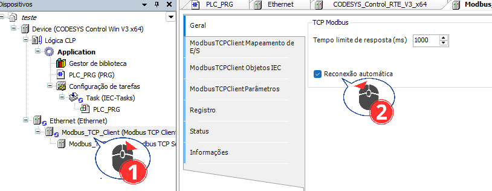

1. Selecione **Modbus_TCP_Client**
2. Marque **Reconexão automática**

---

### 🔹 Passo 21 – Criar canais no Modbus TCP Server
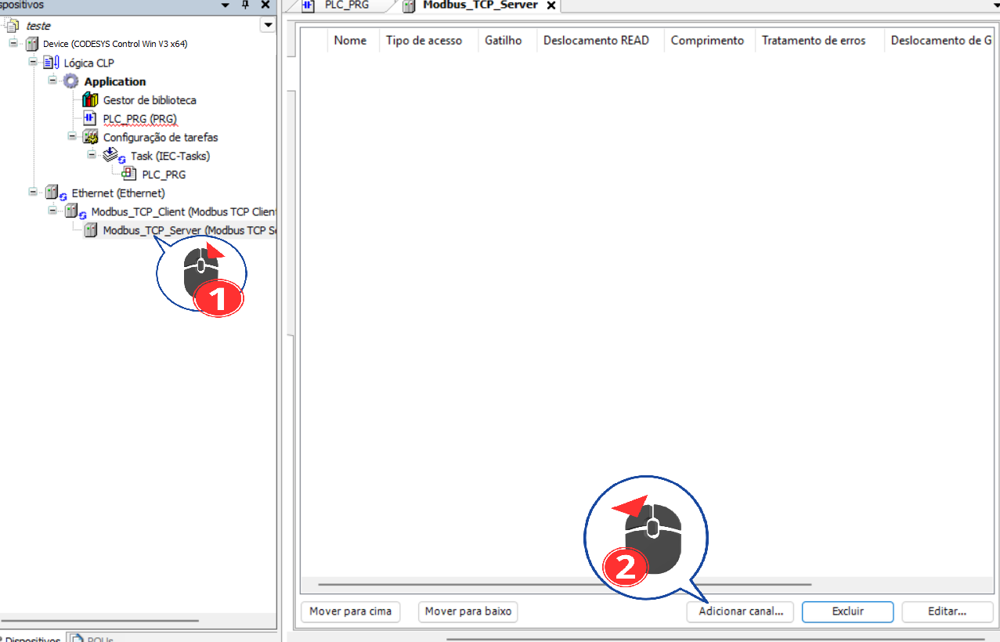

1. Selecione **Modbus_TCP_Server**
2. Clique em **Adicionar canal...**

---

### 🔹 Passo 22 – Configurar o Channel 0 (Coils)

1. Defina o **Nome do canal** (ex.: Channel 0) 
2. Preencha tudo conforme esta a imagem.
3. Clique em **OK**

---

### 🔹 Passo 23 – Adicionar Channel 1 (Discrete Inputs)

1. Clique em **Adicionar canal...**
2. Nomeie como **Channel 1**
3. Tipo: **Read Discrete Inputs (Função 2)**
4. Preencha tudo conforme esta a imagem.
5. Clique em **OK**

---

### 🔹 Passo 24 – Adicionar Channel 2 (Holding Registers)

1. Clique em **Adicionar canal...**
2. Nome: **Channel 2**
3. Tipo: **Write Multiple Registers (Função 16)**
4. Preencha tudo conforme esta a imagem.
5. Clique em **OK**

---

### 🔹 Passo 25 – Adicionar Channel 3 (Input Registers)
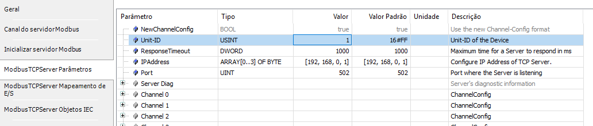

1. Clique em **Adicionar canal...**
2. Nome: **Channel 3**
3. Tipo: **Read Input Registers (Função 4)**
4. Preencha tudo conforme esta a imagem.
5. Clique em **OK**

---

### 🔹 Passo 26 – Conferir os canais criados

1. Verifique se os **Channels 0 a 3** aparecem corretamente

💡 *Resumo do que o servidor Modbus irá disponibilizar.*

---

### 🔹 Passo 27 – Ajustar o Unit-ID do Modbus TCP Server

1. Acesse **ModbusTCPServer Parâmetros**
2. Ajuste o **Unit-ID** para **1** 

💡 *Se estiver trabalhando com um dispositivo que não é 1 coloque o valor correspondente dele.*

---

### 🔹 Passo 28 – Mapear variáveis do PLC

1. Acesse **Mapeamento de E/S**
2. Nomeie todas as variáveis do PLC aos canais Modbus conforme a imagem (ex.: **D2**)

💡 *Aqui ocorre a integração PLC ↔ Modbus.*

---

### 🔹 Passo 30 – Inserir uma bobina no Ladder

1. Abra **PLC_PRG**
2. Clique com botão direito → **Inserir bobina**

---

### 🔹 Passo 31 – Selecionar a variável da bobina

1. Clique no botão **...**
2. Selecione a variável (ex.: **RELE**)
3. Clique em **OK**

---

### 🔹 Passo 32 – Resultado final no Ladder

1. Faça o mesmo da etapa anterior para a bobina.
✅ No final você deve ter o **Contato (RTN1)** e a **bobina (RELE)** adicionados com sucesso.

---

### 🔹 Passo 29 – Login e execução do PLC
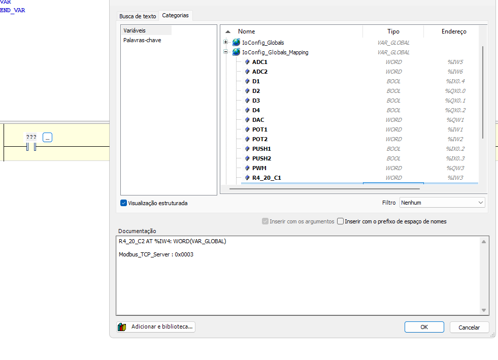

1. Clique em **Login**
2. Clique em **Run / Iniciar**

💡 *Nesta etapa o plc é inicido. Vá ate a ESP clique no botão RTN1 e a bobina RELE será acionada.*

---

  
<strong> 📡 Preparando a ESP32 (ESP_Remote_IO) </strong>

### 🔹 Passo 1 – Criar um fork do repositório no GitHub

1. Acesse o repositório **EININDII08_Codesys_EspRemoteIO**
2. Clique no botão **Fork** (ou **bifurcação** em pt-BR) no canto superior direito
3. Aguarde a criação da cópia do repositório em sua conta

💡 *O fork permite editar e clonar o projeto sem alterar o repositório original.*

---

### 🔹 Passo 2 – Confirmar a criação do fork

1. Verifique se o **Owner** agora é a sua conta
2. Confirme o nome do repositório
3. Clique em **Create fork** (caso ainda não tenha confirmado)

---

### 🔹 Passo 3 – Abrir o Visual Studio Code

1. Abra o **Visual Studio Code**
2. No menu superior, clique em **Arquivo**
3. Selecione **Fechar Pasta**, caso exista algum projeto aberto

⚠️ *Isso evita conflitos ao abrir o novo projeto.*

---

### 🔹 Passo 4 – Abrir a tela inicial do VS Code

1. Na tela inicial do VS Code, no barra lateral esquerda clique no botão referente a **Controle de Código ***
2. Na seguencia clique no botão **Clone Repository**
3. Certifique-se de que nenhuma pasta está aberta

---

### 🔹 Passo 5 – Selecionar clonagem via GitHub

1. Selecione a opção **Clonar do GitHub**
2. Caso solicitado, autorize o acesso à sua conta GitHub

---

### 🔹 Passo 6 – Escolher o repositório ESP_Remote_IO

1. Na lista de repositórios, selecione:
   **EININDII08_Codesys_EspRemoteIO**
2. Aguarde o início do processo de clonagem

---

### 🔹 Passo 7 – Abrir o projeto clonado

1. Quando solicitado, clique em **Abrir**
2. Aguarde o VS Code carregar os arquivos do projeto

---

### 🔹 Passo 8 – Verificar a estrutura do projeto

1. Confirme a presença das pastas:
   - `src`
   - `include`
   - `lib`
   - `platformio.ini`
2. Abra o arquivo **platformio.ini** para conferência
3. Certifique-se de que o valor da tag **kitid** seja o da **Esp32** que vc esta usando.

💡 *Este arquivo define a placa ESP32, rede e bibliotecas.*

---

### 🔹 Passo 9 – Iniciar o upload para a ESP32

1. Na barra inferior do VS Code, clique em **PlatformIO: Upload**
2. Aguarde o início do processo de compilação

---

### 🔹 Passo 10 – Compilação e gravação concluídas

1. Observe o terminal do PlatformIO
2. Confirme as mensagens:
   - `SUCCESS`
   - `Firmware uploaded`
3. A ESP32 está pronta para comunicação Modbus

✅ *O firmware foi compilado e gravado com sucesso na ESP32.*

---

  
<strong> 📡 Vinculando a ESP32 ao Codesys </strong>

---

  
<strong>✅ Resultado esperado</strong>

Ao final:
- ESP32 operando como **Remota Modbus**
- Comunicação estável com o CODESYS
- Leituras e escritas funcionais

---

  
<strong>⚠️ Observações importantes </strong>

- Sempre salvar o projeto após grandes alterações
- Conferir IP antes de colocar em RUN
- Em caso de erro, verificar firewall do Windows

---

  
<strong>📚 Referências </strong>

- Repositório ESP_Remote_IO:
  https://github.com/ININDII-UFU/EININDII08_EspRemoteIO
- Documentação CODESYS

